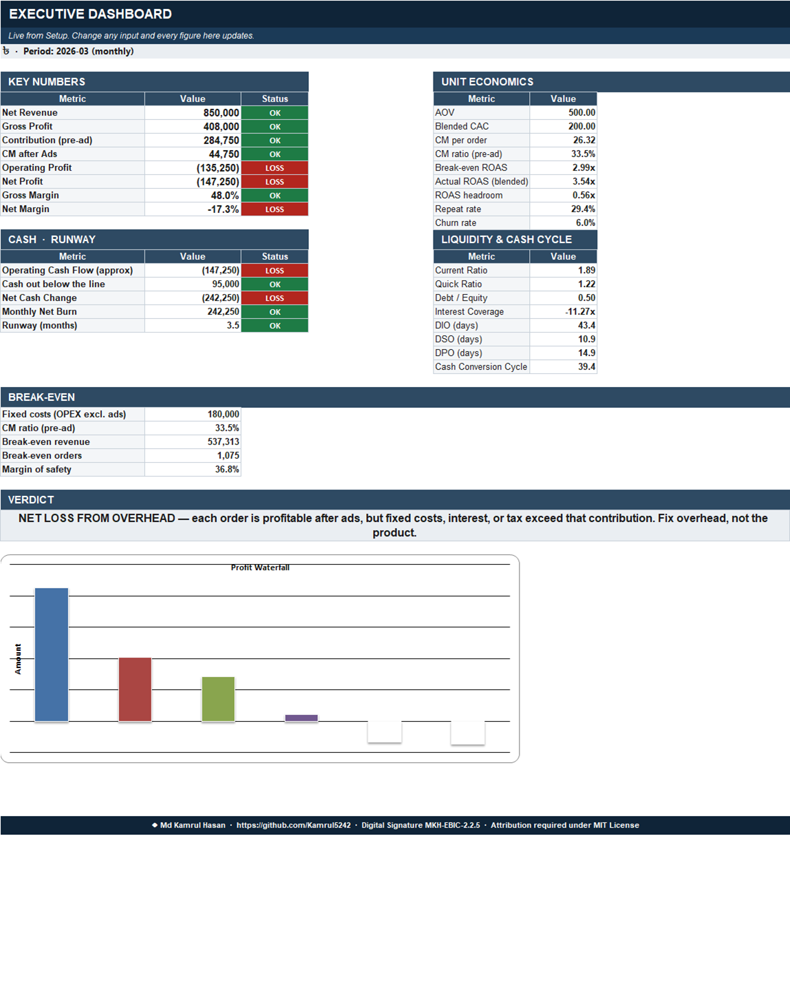
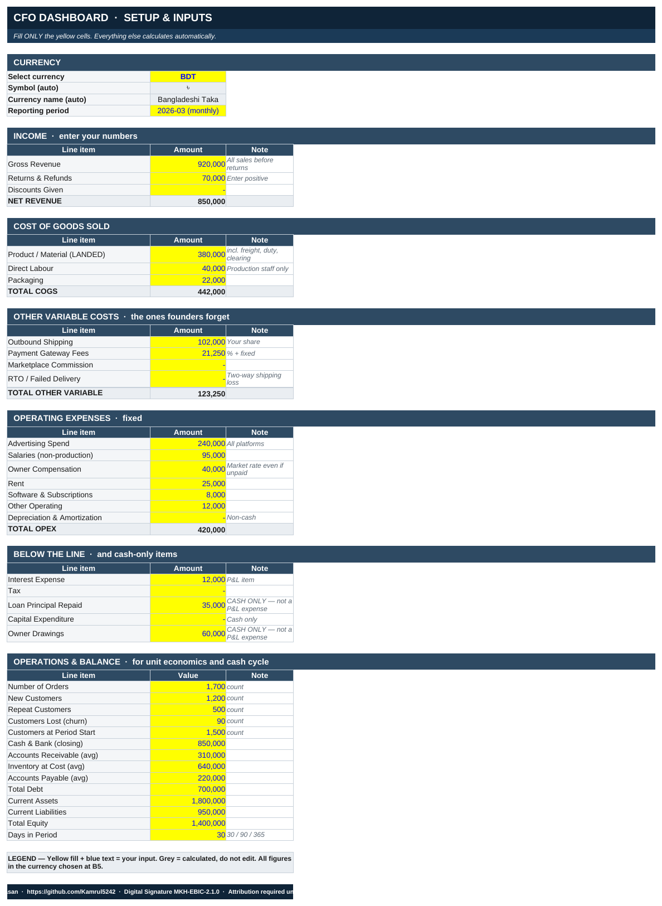
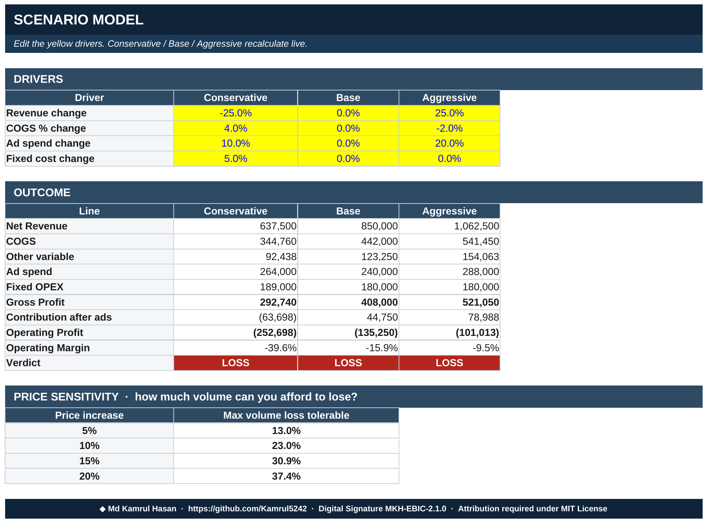
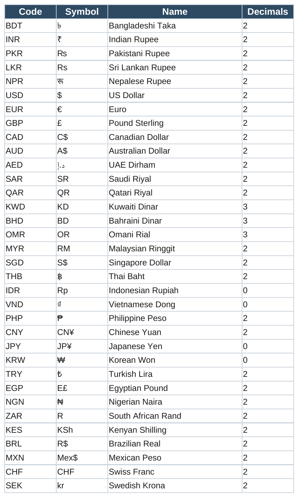
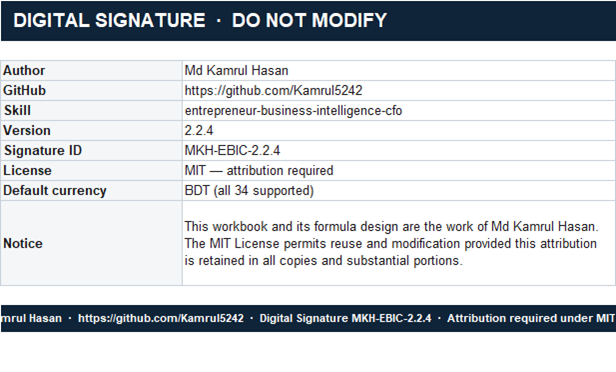

<div align="center">

# 💼 Entrepreneur Business Intelligence & CFO

**An AI skill that turns business numbers into founder decisions — not glossaries.**

*Works on Claude, ChatGPT, Gemini, Cursor, Windsurf, GitHub Copilot, and any agent that reads `AGENTS.md`.*

[](LICENSE)
[](CHANGELOG.md)
[](SIGNATURE.json)
[](references/08-currency.md)
[](assets/cfo-premium-dashboard.xlsx)

**Author: [Md Kamrul Hasan](https://github.com/Kamrul5242)**

</div>

---

## What this is

Most "AI CFO" prompts recite ratio definitions. This one doesn't stop there —
it runs a fixed chain on every question:

```
Extract → Validate → Calculate → Reconcile → Diagnose → Stress-test → Recommend
```

Ask it *"Revenue ৳8.5 lakh, ROAS 3.5x — why am I losing money?"* and it
computes break-even ROAS, shows the exact formula, names the real cause, and
tells you what to fix this week — not a definition of ROAS.

It ships with a **live Excel dashboard** (screenshot below) that does the same
math with real formulas instead of prose.

---

## Screenshots

### Executive Dashboard — live KPIs, RED/GREEN status, auto-diagnosis



*161 formulas across 7 sheets, zero hardcoded results.*

*A **Start Here** sheet opens first and asks for eight numbers, not thirty-eight. The verdict banner The verdict banner is
itself a formula —
it names the **root cause** (broken unit economics vs. overhead drag vs.
healthy), not just "profit is negative."*

### Setup — one input sheet, 34-currency dropdown



*Yellow = your input. Everything else is a formula. Pick any currency and
every symbol in the workbook updates.*

### Scenario Model — Conservative / Base / Aggressive, live



*Edit the yellow drivers, watch all three columns and the price-sensitivity
table recalculate. No copy-pasted "what-if" columns to keep in sync.*

> **Note:** these screenshots were captured from the v2.1.0 workbook (5 sheets,
> 90 formulas). The sheets they show are unchanged, but v2.2.0 adds two more —
> **0. Start Here** and **4. Trend** — which do not appear in them, and adds a
> gold `◀ START HERE` marker beside the eight essential inputs on Setup.

<details>
<summary><strong>More screenshots — currency reference & signature sheet</strong></summary>




</details>

---

## Why it's different

| | Typical "CFO GPT" prompt | This skill |
|---|---|---|
| Depth | Recites formulas | Extracts → validates → **computes** → diagnoses → recommends |
| Arithmetic | Model does it in its head | Offloaded to a tested Python calculator |
| Verdict | "Looks concerning" | Names the exact root cause, in ৳/$/€, with the formula shown |
| Currency | Assumes USD | **BDT default**, 34 currencies, lakh/crore aware |
| Excel | None | 161-formula live dashboard, 12-month trend, guided start, zero hardcoded numbers |
| Portability | One platform | Claude, GPT, Gemini, Cursor, Copilot, AGENTS.md, raw system prompt |
| Token cost | Loads everything | Router loads 1–3 files on demand — **~75% smaller** always-on core |
| Provenance | None | SHA-256 signed manifest, tamper-detectable |

---

## Install

Pick your platform. Full instructions for every one are in
[`docs/INSTALL.md`](docs/INSTALL.md).

<table>
<tr><td width="50%">

**Claude (claude.ai / Desktop / Mobile)**
```
Settings → Capabilities → Skills → Upload
→ upload this repo as a .zip
```

**Claude Code**
```bash
mkdir -p ~/.claude/skills
cp -r entrepreneur-business-intelligence-cfo \
  ~/.claude/skills/
```

**OpenAI Custom GPT**
```
Configure → Instructions →
paste platforms/universal-compact-core.md
(7,867 chars — fits the 8,000 cap)
```

</td><td width="50%">

**Cursor**
```bash
mkdir -p .cursor/rules
cp platforms/cursor-rule.mdc \
  .cursor/rules/cfo.mdc
```

**GitHub Copilot**
```bash
mkdir -p .github
cp platforms/copilot-instructions.md \
  .github/copilot-instructions.md
```

**Gemini / any other chat UI**
```
Paste platforms/universal-compact-core.md
as custom instructions
```

</td></tr>
</table>

---

## Try it

```
"Revenue ৳9.2 lakh, returns ৳70k, COGS ৳4.42 lakh, ad spend ৳2.4 lakh,
1700 orders — why am I not making money?"

"কত টাকা ঢুকেছে আর কত টাকা বের হয়েছে এই মাসে?"

"Should I raise my price 10%? I'm scared of losing customers."

"I made ৳4 lakh profit but my bank balance went down. Why?"

"Investor wants 20% for 50 lakh. Is that fair?"

"Can I afford a ৳10 lakh loan at 14% over 3 years?"
```

Or open [`assets/cfo-premium-dashboard.xlsx`](assets/cfo-premium-dashboard.xlsx)
directly and edit the yellow cells.

---

## The Excel dashboard

```bash
# rebuild it after editing scripts/build_dashboard.py.
# The workbook is a signed asset, so overwriting is opt-in:
python3 scripts/build_dashboard.py --force
python3 scripts/verify_signature.py --generate   # re-sign after rebuilding

# or build somewhere else and leave the signed copy alone:
python3 scripts/build_dashboard.py -o /tmp/dashboard.xlsx

# and the CLI calculator — no pip install, stdlib only
python3 scripts/cfo_calc.py roas --revenue 850000 --spend 240000 --cm-ratio 0.335

# regression tests — asserts the calculator agrees with 06-worked-examples.md
python3 scripts/test_cfo_calc.py

# one command for the whole picture: fill the CSV, then
python3 scripts/cfo_calc.py intake --file assets/business-data-intake-example.csv
```

| Sheet | What's on it |
|---|---|
| **0. Start Here** | Plain-language guide: three steps, the eight numbers that matter, what each sheet does, in English and Bangla |
| **1. Setup** | Every input, yellow-only, 34-currency dropdown |
| **2. Dashboard** | KPI cards w/ RED-GREEN status · unit economics · cash & runway · liquidity & cash cycle · break-even · auto-diagnosing verdict · profit chart |
| **3. Scenarios** | Conservative/Base/Aggressive with editable drivers + price-sensitivity table |
| **4. Trend** | 12 months side by side — contribution, operating profit, cumulative profit, MoM growth, revenue-vs-profit chart |
| **Ref** | 34-currency master table |
| **Signature** | Locked, password-protected provenance record |

**Design decisions worth knowing about**, from actually testing this against
edge cases rather than shipping the first pass:

- The verdict formula checks *"contribution margin after ads < 0"* **before**
  *"net profit < 0"* — not the other way around. The two aren't independent:
  a negative CM-after-ads always implies a negative net profit (fixed costs,
  interest, and tax are never negative), so checking net-profit first would
  silently swallow the more specific, more actionable diagnosis. Checking the
  narrower condition first is what makes *"unit economics are broken"* and
  *"overhead is the problem"* show up as genuinely different messages instead
  of one shadowing the other.
- The profit-waterfall chart plots **only currency-valued rows**. Margins are
  percentages (0.0–1.0) — plotting a 0.48 next to a ৳850,000 bar makes the
  margin bar disappear at chart scale, so they're reported in the KPI table
  instead, not charted alongside absolute amounts.

---

## Currency

**Default: BDT (৳).** 34 currencies supported, auto-detected from symbol, ISO
code, "lakh/crore," or a stated market. South Asian digit grouping (২-২-৩,
i.e. `৳৮,৫০,০০০`) is used automatically when the user writes that way.
Zero-decimal currencies (JPY, KRW, IDR, VND) and three-decimal currencies
(KWD, BHD, OMR) are handled correctly — see
[`references/08-currency.md`](references/08-currency.md).

---

## Token efficiency

| | v1.0 | v2.1 |
|---|---|---|
| Always-loaded core | 25,193 chars (~6,300 tok) | 6,400 chars (~1,600 tok) |
| **Reduction** | — | **~75% fewer tokens per trigger** |
| Reference loading | All-or-nothing | 1–3 files, on demand |
| Heavy arithmetic | In-context, drift-prone | Offloaded to `cfo_calc.py` |

The skill enforces its own budget: a one-metric question gets 3–6 lines, not
a report. Full details in [`SKILL.md §1`](SKILL.md).

---

## Digital signature

Signature ID **`MKH-EBIC-2.2.0`**, embedded in 9 independent locations across
the repo, plus a SHA-256 manifest of every file.

```bash
python3 scripts/verify_signature.py
```

Reports `VERIFIED` or `TAMPERED`, naming every modified, missing, or
attribution-stripped file.

> **Honest limit:** these are plain-text and XLSX files. Nothing technical
> stops someone from editing a line out. What this guarantees is that removal
> is **detectable and provable** — and that removing it breaches the MIT
> License's attribution requirement. That's a legal protection, not a
> technical one, and I'd rather say that plainly than oversell it.

---

## Repository structure

```
entrepreneur-business-intelligence-cfo/
├── SKILL.md                          Core skill — router + token policy
├── README.md                         This file
├── LICENSE                           MIT
├── CHANGELOG.md
├── SIGNATURE.json                    SHA-256 integrity manifest
├── CITATION.cff                      Citation metadata for GitHub
├── llms.txt                          Descriptor for AI answer engines
├── .gitattributes                    Pins checkout bytes so hashes verify everywhere
├── docs/
│   ├── INSTALL.md                    Full install guide, every platform
│   └── screenshots/                  This README's images
├── references/
│   ├── 01-formula-library.md         Every formula, units + pitfalls stated
│   ├── 02-diagnostics-playbook.md    8 patterns, root-cause trees, risk register
│   ├── 03-output-templates.md        4 output formats sized to the question
│   ├── 04-benchmarks-and-ranges.md   Orientation ranges, explicitly not standards
│   ├── 05-ecommerce-and-inventory.md POD, marketplace, pre-order, apparel
│   ├── 06-worked-examples.md         3 fully verified end-to-end analyses
│   ├── 07-data-intake.md             Messy / incomplete data handling
│   └── 08-currency.md                34 currencies, BDT default, lakh/crore
├── scripts/
│   ├── cfo_calc.py                   13-command calculator, stdlib only
│   ├── build_dashboard.py            Rebuilds the Excel workbook
│   ├── verify_signature.py           Integrity + attribution checker
│   └── test_cfo_calc.py              20 regression tests, stdlib unittest
├── assets/
│   ├── cfo-premium-dashboard.xlsx    Live 7-sheet dashboard, 161 formulas
│   ├── business-data-intake-template.csv   Blank — fill this in
│   └── business-data-intake-example.csv    Worked example 1, filled
├── requirements.txt                  openpyxl pin (workbook only; the
│                                     calculator is stdlib-only)
└── platforms/                        The core instructions, per-tool
    ├── universal-compact-core.md     Markdown, 7.9 KB — fits an 8 K box
    ├── system-prompt.txt             Plain text, no markup — raw system prompt
    ├── gemini-gem-instructions.md    Gemini Gem Persona/Task/Context/Format
    ├── cursor-rule.mdc               + Cursor rule frontmatter
    ├── windsurf-rules.md             + Windsurf rules format
    ├── copilot-instructions.md       + Copilot instructions format
    └── AGENTS.md                     AGENTS.md convention
```

---

## License

MIT — see [`LICENSE`](LICENSE). Attribution to **Md Kamrul Hasan** is required
in copies and substantial portions.

---

<div align="center">

**Md Kamrul Hasan** · [github.com/Kamrul5242](https://github.com/Kamrul5242) ·
signature `MKH-EBIC-2.2.0`

</div>
